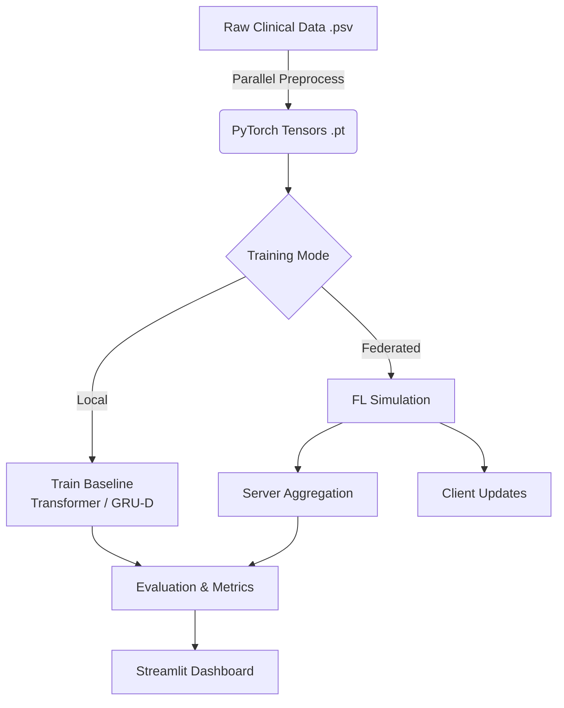

<div align="center">

# 🏥 Neonatal Sepsis Detection Framework
### Federated Learning | Time-Series Transformers | Privacy Preservation

[](https://www.python.org/)
[](https://pytorch.org/)
[](https://neonatal-sepsis.streamlit.app/)
[](https://opensource.org/licenses/MIT)

<a href="https://neonatal-sepsis.streamlit.app/">
  
</a>

<p align="center">
  <b>A comprehensive research codebase for modelling and evaluating time-series models for neonatal sepsis detection.</b><br>
  Features <i>Federated Learning simulations</i>, <i>Secure Aggregation</i>, and <i>Transformer-based architectures</i>.
</p>

</div>

---

## 📖 Abstract

**Neonatal-Sepsis** addresses the critical challenge of early sepsis detection in neonates using time-series clinical data. This repository implements a complete pipeline that allows researchers to:
1.  **Preprocess** raw clinical logs (pipe-separated values) into deep-learning-ready tensors.
2.  **Train** state-of-the-art baselines (Transformers, GRU-D for missing data).
3.  **Simulate** a Federated Learning environment to preserve patient privacy.
4.  **Visualize** predictions via an interactive web dashboard.

---

## 📑 Table of Contents

- [Key Features](#-key-features)
- [Repository Structure](#-repository-structure)
- [System Architecture](#-system-architecture)
- [Dataset & Format](#-dataset--format)
- [Installation](#-installation--setup)
- [Usage](#%EF%B8%8F-usage)
- [Evaluation Results](#-evaluation-results)
- [Contributors](#-contributors)
- [Contact](#-contact)

---

## ⚡ Key Features

| Component | Description |
| :--- | :--- |
| **Preprocessing** | Parallelized pipeline converting `.psv` to `.pt` objects. |
| **Model** | Includes **Transformers** and **GRU-D** (handling missingness via decay). |
| **Federated Learning** | Simulation of Server-Client architecture with local networking. |
| **Privacy PoC** | Secure Aggregation Proof-of-Concept using additive masking. |
| **Visualization** | Complete dashboard for AUROC/AUPRC metrics and real-time inference. |

---

## 📂 Repository Structure

```text
Neonatal-Sepsis/
├── app.py                  # Streamlit entry point
├── app_pages/              # Dashboard UI pages
│   ├── 1_Project_Summary.py
│   ├── 2_Predict.py
│   └── 3_Model_Metrics.py
├── src/
│   ├── parallel_preprocess.py   # Data cleaning pipeline
│   ├── model.py                 # Transformer Architecture
│   ├── model_grud.py            # GRU-D Architecture
│   ├── fl_server.py             # Federated Server Logic
│   ├── fl_client.py             # Federated Client Logic
│   └── secure_agg_poc.py        # Privacy Preservation Logic
├── data/                   # Dataset storage (Gitignored)
└── requirements.txt        # Python dependencies

```

---

## 🛠 System Architecture



---

## 📊 Dataset & Format

The pipeline expects **Pipe-Separated Values (`.psv`)**. Each file represents one patient encounter.

* **Location:** Place raw files in `data/raw/` (e.g., `data/raw/patient_01.psv`).
* **Key Columns:** `HR`, `O2Sat`, `Temp`, `SBP`, `MAP`, `Resp`, `Lactate`, `Age`, `HospAdmTime`.
* **Target:** `SepsisLabel` (Binary: 0 or 1).

> **Note:** The `parallel_preprocess.py` script automatically handles `NaN` values and generates masking features required for the GRU-D model.

---

## 📦 Installation & Setup

### Prerequisites

* **Python 3.8+**
* **CUDA** (Optional, for GPU acceleration)

### 1. Clone & Environment

```bash
git clone [https://github.com/pranay9981/Neonatal-Sepsis.git](https://github.com/pranay9981/Neonatal-Sepsis.git)
cd Neonatal-Sepsis

# Create virtual environment
python -m venv .venv
source .venv/bin/activate  # Windows: .venv\Scripts\Activate.ps1

# Install dependencies
pip install -r requirements.txt

```

### 2. Run Preprocessing

```bash
python src/parallel_preprocess.py \
  --raw_folder data/raw \
  --out_folder data/processed/patients \
  --seq_len 48 \
  --nprocs 8

```

---

## 🖥️ Usage

### 📊 Running the Dashboard

Access the prediction interface locally:

```bash
streamlit run app.py

```

*Or visit the live deployment: [neonatal-sepsis.streamlit.app*](https://neonatal-sepsis.streamlit.app/)

### 🤖 Training Models

**Local Transformer Baseline:**

```bash
python src/train_local.py --index data/processed/patients/index.pt --model transformer

```

**Federated Simulation (Server):**

```bash
python src/fl_server.py --model transformer --rounds 5 --min_clients 2

```

---

## 📉 Evaluation Results

The table below summarizes the performance metrics of our **Global Best (Federated)** model compared to the **Model Best (Local)** baseline.

| Model | AUROC | AUPRC | Accuracy | F1-Score | Precision | Recall |
| --- | --- | --- | --- | --- | --- | --- |
| **Global Best** | **0.894** | **0.567** | **0.947** | **0.579** | **0.712** | 0.487 |
| **Model Best** | 0.829 | 0.410 | 0.739 | 0.299 | 0.187 | **0.749** |

---

## 🤝 Contributors

This project is developed and maintained by:

* **[Pranay](https://github.com/pranay9981)** - *Maintainer*
* **[Ninad Amane](https://github.com/NinadAmane)** - *Collaborator*
* **[Rakshak](https://github.com/Rakshak05)** - *Collaborator*

---

## 📞 Contact

If you encounter any bugs or have feature requests, please open an issue on our **[GitHub Issues](https://github.com/pranay9981/Neonatal-Sepsis/issues)** page.

---

## 📜 License

Distributed under the MIT License. See `LICENSE` for more information.
